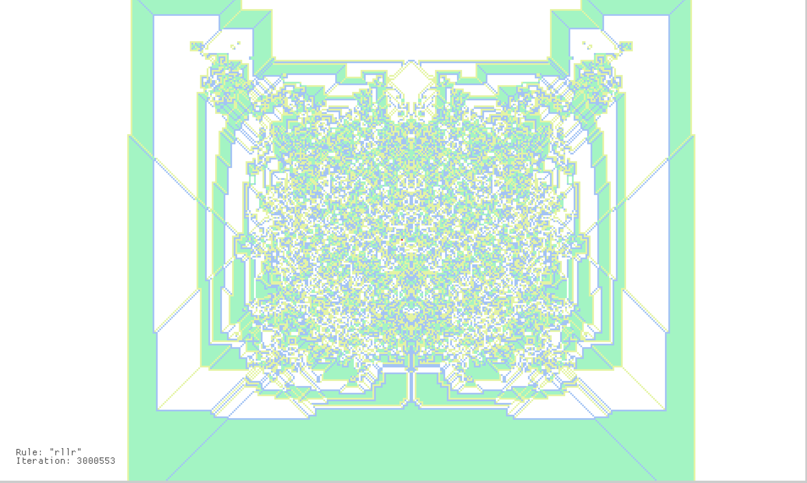

## Overview

Langton’s Ant is a 2D cellular automaton where an agent (“the ant”) moves on an infinite grid and updates cell states based on simple rules. Despite the simple rules, complex behaviour can emerge after several iterations.

## Usage

```
cargo run --release -- [OPTIONS]
Options
-t, --tick-rate-ms <TICK_RATE_MS>   Simulation speed (ms per update)
-c, --cell-size <CELL_SIZE>         Size of a cell in pixels
-s, --skip-iter <SKIP_ITER>         Number of iterations to skip at start
-r, --rule <RULE>                   Rule string (default: RL)

```

## Examples
#### Classic Langton’s ant
```shell
cargo run -- -r rl
```

#### Multi-state rule
```shell
cargo run -- -r rllr
```

#### Faster simulation
```shell
cargo run -- -t 10 -c 8
```

#### Skip initial chaos
```shell
cargo run -- -s 1000
```

## Rule System

Rules are defined as strings where:

- R → turn right
- L → turn left

Each character represents a cell state. At each step:

- Read current cell state (default = 0, white)
- Turn according to rule
- Advance cell state cyclically
- Move forward

#### Example:

- **RL**   → 2 states (classic) -> 2 colors
- **RLLR** → 4 states -> 4 colors
To see what kind of pattern should emerge from which rules and after how many iterations, you can refer to the [wikipage](https://en.wikipedia.org/wiki/Langton%27s_ant).

## Rendering
The grid is infinite but rendered through a viewport centered on the ant. Cells are stored sparsely (only modified cells to avoid heavy computations). Colors are generated dynamically from cell state.

<div align="center">
  
</div>

## Future Ideas
- [ ] Additional turn types (N, U)
- [ ] Multiple ants
- [ ] Different grid topologies (hex, triangular)
- [ ] Interactive controls (pause, step, speed adjust)
